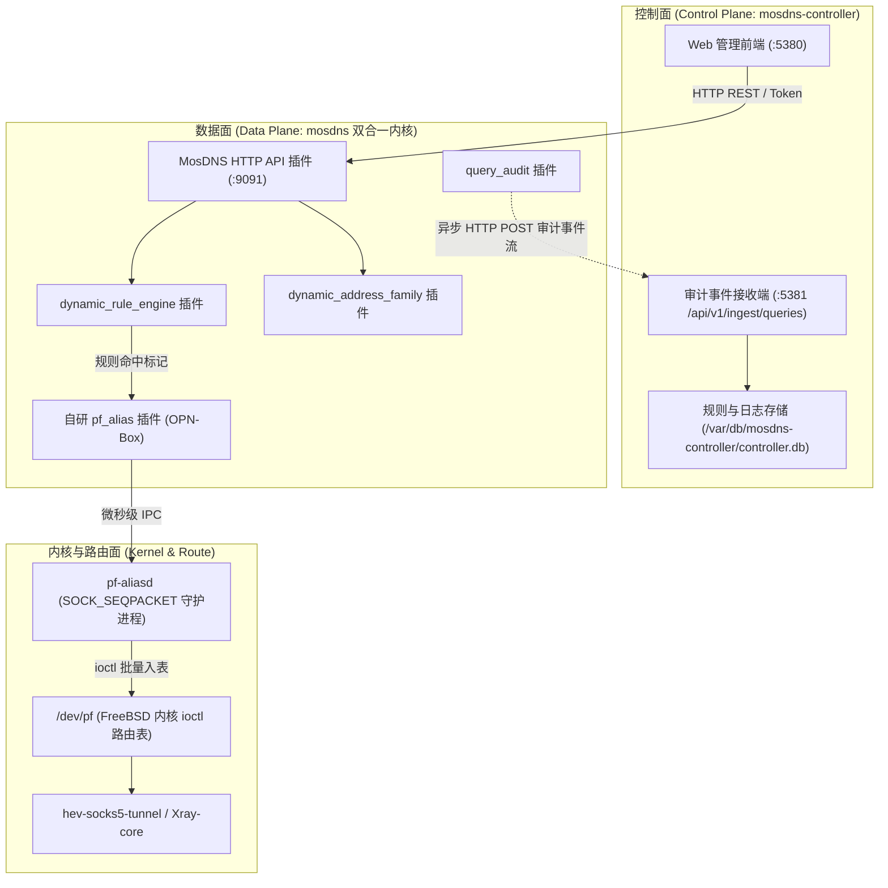

# OPN-Box 开发与演进计划：MosDNS Controller 与自研双合一内核集成

本文档记录了关于 `luoye663/mosdns-controller` Web 管理控制台与 OPN-Box 自研 MosDNS 内核深度集成的技术分析、架构设计与后续落地开发任务清单。

---

## 一、项目背景与集成目标

### 1.1 背景
- `luoye663/mosdns-controller` 提供了面向局域网的高颜值 MosDNS Web UI 管理面板，具备动态规则编辑、黑白名单管理、多上游组切换、查询日志流（SSE 实时流）及基于 SQLite 的统计图表功能。
- 在其官方实现中，根仓库通过 Git Submodule 绑定了一个名为 `mosdns` 的分支（`https://github.com/luoye663/mosdns.git`，分支 `managed-dns`）。
- OPN-Box 项目核心基于 **自研 `pf_alias` 插件 + `/dev/pf` 常驻守护进程 `pf-aliasd`** 实现微秒级零首包竞态策略路由，必须使用我们自编译的 MosDNS 内核。

### 1.2 目标
- **完全解耦 Submodule 内置 mosdns**：不使用其内置打包的 mosdns，独立运行 `mosdns-controller`。
- **构建单一“双合一增强内核”**：自编译统一的 `/usr/local/bin/mosdns`，使其既原生支持 Controller 的所有控制面接口，又内置自研 `pf_alias` 内核同步插件。
- **完善 FreeBSD / OPNsense 生产级运行支撑**：补齐缺失的 `rc.d` 守护进程启动脚本、配置文件样例、OPNsense 服务动作（`actions.d`）与打包集成流水线。

---

## 二、架构分析与协同机制

### 2.1 控制面与数据面解耦架构



### 2.2 通信契约与插件矩阵

Controller 与 MosDNS 之间通过 HTTP REST API 进行松耦合通信，所有交互均通过共享密钥文件（`controller.token`，Bearer Token）认证：

1. **`dynamic_rule_engine` 插件**：
   - 接收 Controller 下发的白名单、黑名单、域名分流规则与正则；
   - 支撑规则快照持久化（`/usr/local/etc/mosdns/dynamic-rules.json`），实现热重载，**修改规则不中断 53 端口 DNS 监听**。
2. **`dynamic_address_family` 插件**：
   - 接收 Controller 动态策略下发，支持即时切换双栈（Dual-Stack）、仅 IPv4、仅 IPv6。
3. **`query_audit` 插件**：
   - 数据面每次完成 DNS 解析后，将查询结果、耗时、客户端 IP、采纳的上游标签等元数据异步压入内部队列；
   - 批量异步推送到 Controller 的内部接收端口（`:5381/api/v1/ingest/queries`），由 Controller 提供 SSE 实时流与 SQLite 统计。
4. **自研 `pf_alias` 插件（OPN-Box 核心）**：
   - 紧接在 DNS 解析成功后执行；
   - 提取境外/代理域名的解析 IP，通过 Unix Domain Socket 阻塞同步给 `pf-aliasd`，保证**首包 SYN 发起前 IP 必在 `/dev/pf` 表中**。

### 2.3 统一 MosDNS 处理流水线示例 (`config.yaml`)

```yaml
log:
  level: info

# Controller 控制面通过该 API 操作 MosDNS 数据面
api:
  http: "127.0.0.1:9091"

plugins:
  # 1. 动态规则引擎 (供 Controller WebUI 热更新黑白名单)
  - tag: dynamic_rules
    type: dynamic_rule_engine
    args:
      snapshot_file: "/usr/local/etc/mosdns/dynamic-rules.json"
      auth_token_file: "/usr/local/etc/mosdns/controller.token"
      marks:
        access_block: 1001
        access_allow: 1002

  # 2. 动态 IPv4/IPv6 响应策略
  - tag: address_family
    type: dynamic_address_family
    args:
      snapshot_file: "/usr/local/etc/mosdns/address-family.json"
      auth_token_file: "/usr/local/etc/mosdns/controller.token"

  # 3. 自研 pf_alias 内核同步插件 (零首包竞态)
  - tag: sync_to_pf
    type: pf_alias
    args:
      socket_path: "/var/run/pf-aliasd.sock"
      table: "GFW_Proxy"
      min_ttl: 60
      sync: true

  # 4. 异步审计流 (推送给 Controller Web 实时日志与图表)
  - tag: query_audit
    type: query_audit
    args:
      endpoint: "http://127.0.0.1:5381/api/v1/ingest/queries"
      auth_token_file: "/usr/local/etc/mosdns/controller.token"
      queue_size: 1024
      batch_size: 64

  # 5. 主流水线：无缝协同
  - tag: main_sequence
    type: sequence
    args:
      exec:
        - dynamic_rules      # [步骤1] WebUI 动态规则过滤与标记
        - forward_remote     # [步骤2] DNS 上游解析
        - sync_to_pf         # [步骤3] 命中代理 IP 立即微秒级同步写入 /dev/pf
        - query_audit        # [步骤4] 审计日志异步流送至 Web 界面
        - _return
```

---

## 三、当前代码库现状与缺失诊断 (Gap Analysis)

经审查，当前仓库存在以下必须补齐的断点：

| 组件 / 模块 | 现状 | 缺陷 / 缺失诊断 | 改造方案 |
| :--- | :--- | :--- | :--- |
| **`rc.d/mosdns`** | ❌ 缺失 | 仓库中没有 `mosdns` 的 FreeBSD 服务启动脚本，导致 `actions_mosdns.conf` 调用失败。 | 编写标准 `rc.d/mosdns`，使用 `daemon` 托管，支持配置文件检查与 pidfile。 |
| **`rc.d/mosdns_controller`** | ❌ 缺失 | 仓库中没有 `mosdns-controller` 的启动脚本，无法开机自启和作为后台守护进程常驻。 | 编写标准 `rc.d/mosdns_controller`，托管后台运行、日志输出与 pid 管理。 |
| **`actions_mosdns.conf`** | ⚠️ 不完整 | 仅配置了 `mosdns` 与 `pf_aliasd`，未纳入 `mosdns-controller`。 | 增加 `controller.start/stop/restart/status` 及联合启停配置。 |
| **配置文件样例** | ⚠️ 缺失 | 缺少 `config.mosdns-controller.example.yaml`。 | 新增样例，定义 Web 端口 `:5380`、内部端口 `:5381`、存储路径与 Token 文件路径。 |
| **目录规范与 Token** | ⚠️ 待定义 | FreeBSD 规范存储路径与共享通信 Token 未初始化。 | 规划 `/var/db/mosdns-controller/`、自动生成 32 字节 hex Token `/usr/local/etc/mosdns/controller.token`。 |
| **`build_binaries.sh`** | ⚠️ 需升级 | 目前 `mosdns` 从 `IrineSistiana/mosdns` 官方拉取，缺少 Controller 插件。 | 改为从 `luoye663/mosdns`（`managed-dns` 分支）拉取并注入 `pkg/plugin/`（`pf_alias`），编译双合一内核。 |
| **`package_repo.sh`** | ⚠️ 需补齐 | 打包 `mosdns` 与 `mosdns-controller` 时未收录 rc 脚本和新配置文件。 | 在 plist 和 stage 中补全 `rc.d/mosdns`、`rc.d/mosdns_controller` 及配置文件。 |

---

## 四、后续落地开发任务清单 (Roadmap)

### Task 1: 编写 `rc.d/mosdns` 与 `rc.d/mosdns_controller`
- [ ] 创建 `rc.d/mosdns`：
  - 变量：`mosdns_enable="NO"`, `mosdns_config="/usr/local/etc/mosdns/config.yaml"`, `mosdns_pidfile="/var/run/mosdns.pid"`, `mosdns_logfile="/var/log/mosdns.log"`
  - 命令：`/usr/sbin/daemon -p ${mosdns_pidfile} -o ${mosdns_logfile} -t mosdns /usr/local/bin/mosdns start -c ${mosdns_config} -d /usr/local/etc/mosdns`
- [ ] 创建 `rc.d/mosdns_controller`：
  - 变量：`mosdns_controller_enable="NO"`, `mosdns_controller_config="/usr/local/etc/mosdns/controller.yaml"`, `mosdns_controller_pidfile="/var/run/mosdns-controller.pid"`
  - 命令：`/usr/sbin/daemon -p ${mosdns_controller_pidfile} -o /var/log/mosdns-controller.log -t mosdns_controller /usr/local/bin/mosdns-controller -config ${mosdns_controller_config}`

### Task 2: 提供配置文件样例与 Token 初始化
- [ ] 创建 `config.mosdns-controller.example.yaml`：
  ```yaml
  server:
    public_listen: "0.0.0.0:5380"
    internal_listen: "127.0.0.1:5381"
  storage:
    path: "/var/db/mosdns-controller/controller.db"
  mosdns:
    base_url: "http://127.0.0.1:9091"
    token_file: "/usr/local/etc/mosdns/controller.token"
  web:
    session_ttl: "24h"
  ```
- [ ] 在 `rc.d/mosdns_controller` 的 `precmd` 或 OPNsense 初始动作中加入 Token 自动生成逻辑：
  `[ ! -f /usr/local/etc/mosdns/controller.token ] && openssl rand -hex 32 > /usr/local/etc/mosdns/controller.token`。

### Task 3: 改造 `scripts/build_binaries.sh`（编译双合一增强内核）
- [ ] 将 MosDNS 源码拉取源切换为 `https://github.com/luoye663/mosdns.git`（分支 `managed-dns`）。
- [ ] 注入 `pkg/plugin/` 到 `plugin/executable/pf_alias`。
- [ ] 在 `main.go` 中注册 `_ "github.com/IrineSistiana/mosdns/v5/plugin/executable/pf_alias"`。
- [ ] 交叉编译 FreeBSD amd64 静态二进制 `/dist/bin/mosdns`。
- [ ] 编译 `mosdns-controller`（内嵌已打包好的 WebUI 前端资源）。

### Task 4: 更新 OPNsense 插件动作 (`actions_mosdns.conf`)
- [ ] 扩展动作，支持独立管理与联合管理：
  - `start` / `stop` / `restart` / `status`：联动 `mosdns`、`pf_aliasd` 与 `mosdns_controller`。
  - `controller.start` / `controller.stop` / `controller.restart` / `controller.status`：专门管理 Controller 面板。

### Task 5: 更新打包发布脚本 (`scripts/package_repo.sh`)
- [ ] 将 `rc.d/mosdns` 与 `config.yaml.sample` 加入 `mosdns` 包 plist。
- [ ] 将 `rc.d/mosdns_controller` 与 `controller.yaml.sample` 加入 `mosdns-controller` 包 plist。
- [ ] 确保目标架构严格为 `FreeBSD:15:amd64`。

