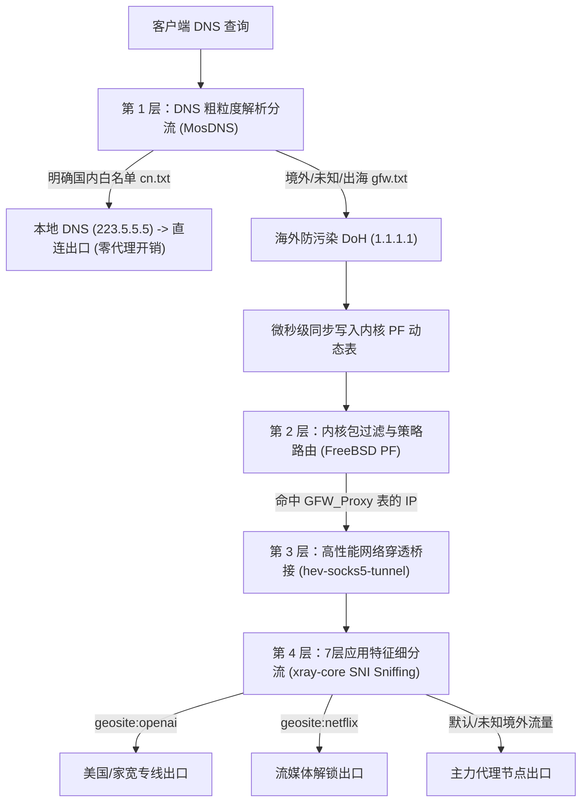
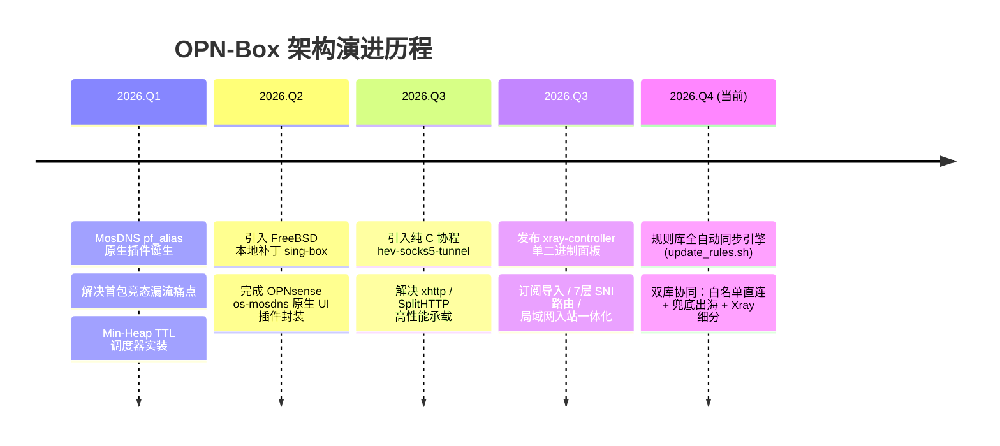

# OPN-Box 核心设计哲学与架构演进

## 一、项目愿景与背景

在软路由与企业级防火墙领域，**OPNsense** 以其坚固的 FreeBSD 内核、现代化的 MVC WebGUI、强大的包过滤（Packet Filter, PF）引擎以及出色的系统稳定性而著称。

然而，传统的 Linux 科学分流方案（如基于 `iptables` / `nftables` 的 TPROXY、REDIRECT 或 Linux 内核 cgroups）**无法直接移植到 FreeBSD 环境**。同时，大部分现存的 FreeBSD/OPNsense 透明代理方案存在以下不可忽视的痛点：

1. **首包竞态漏流**：异步更新防火墙别名导致客户端发起 TCP SYN 时防火墙尚未入表，从而直连泄露或连接超时。
2. **系统资源浪费与崩溃**：Shell 脚本高频 Fork/Exec `/sbin/pfctl` 导致 CPU 飙升；内核 PF 表缺乏到期淘汰机制，条目暴涨直至打爆 `table-entries` 内存上限。
3. **单点协议限制与分流粗糙**：早期方案单一依赖 sing-box 或 clash，对新兴协议（如 CDN 承载的 `xhttp` SplitHTTP、REALITY）缺乏支持；纯 IP 规则无法满足复杂的多站点出口调度需求。
4. **运维割裂**：内核依赖 Linux 工具链，缺乏符合 FreeBSD rc.d 规范与 OPNsense 菜单的原生 Web 控制台。

**OPN-Box** 诞生于此。其终极目标是：**在 FreeBSD / OPNsense 原生生态下，打造一套兼具极致吞吐、零竞态漏流、多出口 7 层精细调度与开箱即用可视化管理的现代化策略路由分流套件。**

---

## 二、四大核心设计哲学

### 1. 分层治理与精准调度 (Layered Governance)

网络分流不是非黑即白的单点决策，而是**由外到内、由浅入深的逐级过滤过程**：

- **L3/L4 粗粒度 (前端)**：以 MosDNS + PF Table 为大门守卫，**白名单直连、未明确与出海走代理**。保障 95% 以上的国内主流流量在 DNS 阶段即以 0 开销直达国内最优 CDN，不给代理链路增加负担。
- **L7 细粒度 (后端)**：出海流量全部汇聚至 `xray-core` 后，利用 7 层 SNI 嗅探技术还原真实访问域名，借助成熟的 `geosite.dat` 规则库进行细分调度。免去在 OPNsense 中维护多张策略路由表或多网卡的灾难级复杂度。

---

### 2. 确定性与零首包竞态 (Determinism & Zero-Race)

传统的 “DNS 解析完放行，后台脚本异步写入防火墙别名” 是伪透明代理的大忌。客户端在收到 DNS 响应（几毫秒内）便会立即发起 TCP 三次握手（SYN）。如果防火墙别名表写入存在几十毫秒乃至秒级的延迟，首包就会被 PF 判定为不命中而走默认 WAN 直连。

- **OPN-Box 哲学**：**未完成入表，绝不返回 DNS 响应**。
- **实现手段**：自研 `pf_alias` 插件，在 DNS 解析拿到 IP 后，通过 Unix Domain Socket 毫秒级同步请求常驻守护进程 `pf-aliasd`。直到 `/dev/pf` 的 `DIOCRADDADDRS` 系统调用成功返回 ACK，DNS 报文才真正送达客户端。

---

### 3. 极速内核交互与内存垃圾回收 (Kernel-Speed & GC)

- **告别外部进程调用**：拒绝频繁调用 `/sbin/pfctl`。`pf-aliasd` 启动时直接打开 `/dev/pf` 句柄常驻内存，通过标准 ioctl 直接操作内核数据结构，将单次操作开销从 15~50ms 压制到 **0.05ms**。
- **内核表 Min-Heap TTL 调度器**：
  DNS 解析记录均具备生存时间（TTL）。OPN-Box 在用户空间维护基于最小堆的到期优先队列，动态续期热点 IP，并在到期后单次调用 `DIOCRDELADDRS` 批量抹除，使内核表条目始终保持动态平衡，彻底规避内存溢出风险。

---

### 4. 彻底拥抱 FreeBSD 原生与松耦合模块化 (FreeBSD-Native & Decoupled)

- 拒绝强依赖 Linux 的工具（如 v2rayA、3X-UI、systemd 脚本）。
- 所有核心组件（`pf-aliasd`、`hev-controller`、`xray-controller`）均编译为 **纯净、静态、无外部 C 运行库依赖的 FreeBSD 64 位原生 ELF 二进制**。
- 各模块职责清晰独立：
  - DNS 引擎可选官方 MosDNS 或演进版 MosDNS-X；
  - 代理传输可选 `hev-socks5-tunnel`、`xray-core`、`sing-box`；
  - 任何单一组件的重启或热重载，均不影响系统其他网络模块的平稳运转。

---

## 三、版本发布与稳定性哲学

在软件源与依赖包管理上，OPN-Box 坚持**自研与官源双轨制**原则：

| 组件分类 | 适用对象 | 版本命名策略 | 考量与依据 |
| :--- | :--- | :--- | :--- |
| **自编译/自研组件** | `pf-aliasd`, `os-mosdns`, `mosdns-controller`, `mosdns-x` | 日期版本号 `YYYY.MM.DD` (CalVer) | 随代码提交频繁迭代，日期版本号最直观反映构建时效与补丁状态。 |
| **外部官方稳定内核** | `hev-socks5-tunnel`, `xray-core` | 锁定上游稳定版本 (如 `2.17.1`, `26.7.11`) | 代理内核稳定性至关重要。拒绝动态拉取不可控的 latest，通过环境变量严格锁定已知无严重漏洞的稳定发布版，杜绝上游隐蔽 breaking change。 |

---

## 四、演进路线图

