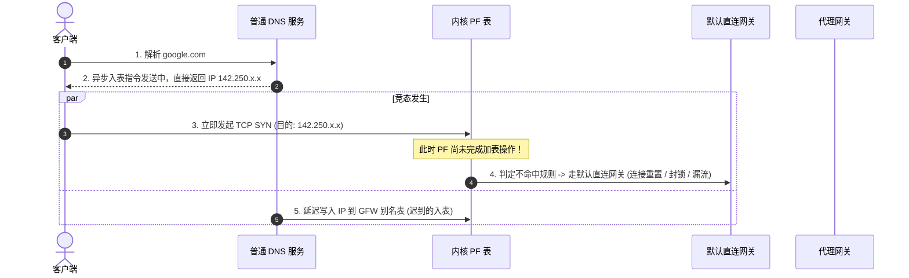
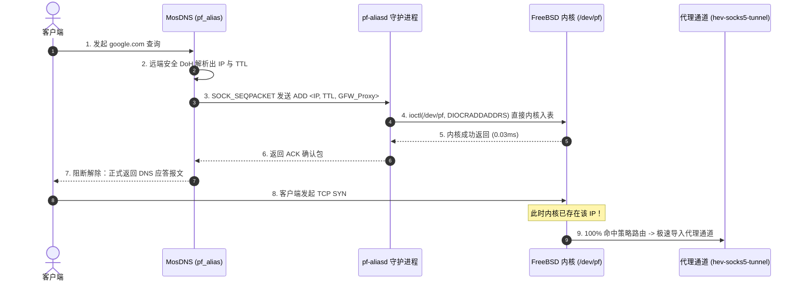

# DNS 动态分流与零竞态内核同步引擎

## 一、首包竞态（First-Packet Race Condition）的本质与破解

在传统的 “DNS 分流 + 防火墙策略路由” 方案中，DNS 服务（如 Dnsmasq、AdGuard Home、普通 MosDNS）在解析出境外 IP 后，通常采用两种入表方式：
1. **异步外部脚本**：在后台启动 Shell 进程执行 `pfctl -t GFW -T add <ip>`；
2. **异步非阻塞通知**：通过消息队列广播，主线程直接向客户端响应 DNS 请求。



### OPN-Box 的零竞态消除方案
OPN-Box 的核心原则是 **“强同步屏障 (Synchronous Barrier)”**：



整个同步往返仅耗时 **0.05 ~ 0.1 毫秒**，客户端察觉不到任何停顿，但彻底保障了 100% 的分流命中率。

---

## 二、系统内部架构与模块职责

```
┌────────────────────────────────────────────────────────────────────────┐
│ MosDNS v5 / MosDNS-X 进程                                              │
│                                                                        │
│   query_is_direct_domain ──> [ 是 ] ──> forward_local (223.5.5.5)      │
│            │                                                           │
│           [ 否 ] (出海名单 + 未分类域名)                                │
│            ▼                                                           │
│   forward_remote (1.1.1.1 / 8.8.8.8 DoH)                              │
│            │                                                           │
│            ▼ 提取 A/AAAA 记录及最小 TTL                                 │
│   pf_alias 插件 (pkg/plugin/pf_alias.go)                               │
│     • 本地 LRU 缓存热点去重 (避免重复查询触发无谓 IPC)                 │
│     • 钳位 TTL (默认 60s ~ 86400s)                                     │
└────────────────────────────┬───────────────────────────────────────────┘
                             │ AF_UNIX / SOCK_SEQPACKET
                             │ /var/run/pf-aliasd.sock (含 100ms 超时保护)
┌────────────────────────────▼───────────────────────────────────────────┐
│ pf-aliasd 常驻守护进程 (cmd/pf-aliasd/main.go)                         │
│                                                                        │
│   • 请求解码 (ADD / DEL / FLUSH)                                       │
│   • 打开常驻句柄: fd = open("/dev/pf", O_RDWR)                         │
│   • 单次系统调用: ioctl(fd, DIOCRADDADDRS, &io)                        │
│   • 优先队列到期调度器 (pkg/ttlcleaner/tracker.go - Min-Heap)          │
│       ├── IP 命中时：动态更新到期时间并调整堆 (O(log N))               │
│       └── 后台 GC 协程 (1s 周期)：批量弹出到期 IP 集合                  │
│            └── 单次批量删除: ioctl(fd, DIOCRADDADDRS, &del_io)         │
└────────────────────────────┬───────────────────────────────────────────┘
                             │
                             ▼
┌────────────────────────────────────────────────────────────────────────┐
│ FreeBSD 内核空间 (Packet Filter Engine)                                │
│                                                                        │
│   table <GFW_Proxy> persist (OPNsense External Alias)                  │
│   RADIX 树高速匹配 -> 命中即执行 route-to (tun0)                       │
└────────────────────────────────────────────────────────────────────────┘
```

---

## 三、通信协议设计：SOCK_SEQPACKET

OPN-Box 在进程间通信中抛弃了低效的纯文本或 JSON 格式，在 `pkg/protocol/` 中设计了紧凑的二进制帧协议，并采用 **`AF_UNIX + SOCK_SEQPACKET`** 套接字类型：

### 为什么选择 SOCK_SEQPACKET？
1. **自带报文边界**：与 `SOCK_STREAM`（需自定义头长度避免粘包）不同，`SEQPACKET` 保证单次 `write` 对应单次 `read`，零内存拼接分包开销。
2. **面向连接与流控**：与 `SOCK_DGRAM`（不可靠、易丢包）不同，`SEQPACKET` 提供连接状态保持与内核级发送缓冲区背压机制。

### 报文格式布局

```text
 0                   1                   2                   3
 0 1 2 3 4 5 6 7 8 9 0 1 2 3 4 5 6 7 8 9 0 1 2 3 4 5 6 7 8 9 0 1
+-+-+-+-+-+-+-+-+-+-+-+-+-+-+-+-+-+-+-+-+-+-+-+-+-+-+-+-+-+-+-+-+
|          Magic (0x5046)       |    Version    |    Command    |
+-+-+-+-+-+-+-+-+-+-+-+-+-+-+-+-+-+-+-+-+-+-+-+-+-+-+-+-+-+-+-+-+
|                           Sequence ID                         |
+-+-+-+-+-+-+-+-+-+-+-+-+-+-+-+-+-+-+-+-+-+-+-+-+-+-+-+-+-+-+-+-+
|                         TTL (Seconds)                         |
+-+-+-+-+-+-+-+-+-+-+-+-+-+-+-+-+-+-+-+-+-+-+-+-+-+-+-+-+-+-+-+-+
|         Table Name (固定 32 字节，以 0x00 填充结尾)           |
|                                                               |
+-+-+-+-+-+-+-+-+-+-+-+-+-+-+-+-+-+-+-+-+-+-+-+-+-+-+-+-+-+-+-+-+
|   IP Type     |   IP Bytes (IPv4: 4 字节 / IPv6: 16 字节)     |
+-+-+-+-+-+-+-+-+-+-+-+-+-+-+-+-+-+-+-+-+-+-+-+-+-+-+-+-+-+-+-+-+
```

- **Magic**：`0x5046` (ASCII "PF")，防错报文过滤。
- **Command**：
  - `0x01`: `CMD_ADD`（入表并注册 TTL）
  - `0x02`: `CMD_DEL`（手动即刻出表）
  - `0x03`: `CMD_FLUSH`（清空表）
  - `0x80`: `CMD_ACK`（操作成功）
  - `0x81`: `CMD_ERR`（内核失败返回）

---

## 四、Min-Heap TTL 到期调度器原理

内核的 PF Table 没有原生的条目生存期（TTL）控制。若只增不减，系统运行一周后表项可达数万条，最终导致 OPNsense 内存耗尽或规则重载超时。

`pf-aliasd` 内置了基于**小顶堆（Min-Heap）**的到期追踪系统（[pkg/ttlcleaner/tracker.go](file:///home/yaofen/opn-box/pkg/ttlcleaner/tracker.go)）：

1. **注册与续期复杂度 O(log N)**：
   - 内部维护 `HashMap[IPString]*HeapNode` 记录堆索引。
   - 当客户端频繁访问 YouTube 或 Google 时，同一 IP 反复被解析。追踪器直接找到对应堆节点，更新其到期绝对时间戳为 `now + new_ttl`，随后执行 `heap.Fix()` 重新平衡堆结构，绝不产生冗余副本。
2. **批量垃圾回收（Batch GC）**：
   - 后台协程每 1 秒检查一次堆顶节点。
   - 若堆顶到期，循环弹出所有满足 `expireTime <= now` 的节点，存入批量数组。
   - 累积的到期 IP 列表打包成一次 `pfr_table` 批量结构体，发起单次 `ioctl(DIOCRDELADDRS)` 系统调用。一次系统调用可同时清除成百上千个陈旧 IP，对系统性能零抖动。

---

## 五、OPNsense 最佳落地配置

### 1. 创建 External (advanced) 别名
- 进入 **Firewall -> Aliases**；
- 新建别名，名称为 `GFW_Proxy`；
- 类型必须选择 **`External (advanced)`**。
> **关键原理**：OPNsense 识别到 `External` 别名时，会在底层生成带有 `persist` 属性的 PF 表（`table <GFW_Proxy> persist`）。这保证了 OPNsense 在日常保存规则或执行 Filter Reload 时，**绝不会冲掉外部程序动态维护的 IP 条目**。

### 2. 配置 LAN 策略路由放行
- 进入 **Firewall -> Rules -> LAN**；
- 创建一条通行规则：
  - **Destination**：选择别名 `GFW_Proxy`；
  - **Gateway**：选择虚拟代理网关（即指向 `tun0` 网卡的 Gateway 目标）。
- 即可让所有命中该表的 IP 流量全部被内核底层拦截并导向 TUN 网卡。
