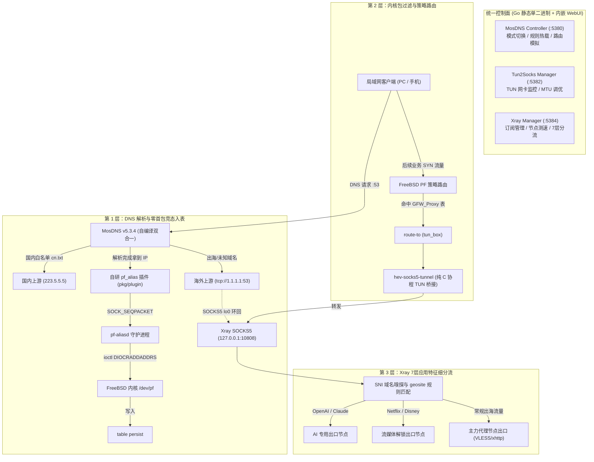

# OPN-Box 架构演进与全链路模块化集成总结

本文档记录了 OPN-Box 从初期技术探索到全面自研与模块化解耦的演进历程、核心架构设计以及各组件的运行规范。

---

## 一、重大决策演进：从第三方控制端走向自研原生控制器

### 1.1 早期探索与痛点诊断
初期曾尝试引入 `luoye663/mosdns-controller` 作为 Web 管理控制台，但在深入评估与适配过程中暴露了严重的系统级痛点：
1. **深度强绑定非官方分叉**：上游强依赖其特定的 `managed-dns` 源码分支，无法直接与 MosDNS 官方版本及自研的 `pf_alias` 插件平滑集成；
2. **技术栈沉重且跨平台水土不服**：原实现采用 Node.js/Vue 前后端分离编译，依赖 SQLite 数据库与外部 API 中转层，原本主要面向 Linux systemd 环境，在 FreeBSD / OPNsense 下进程生命周期与资源占用均显臃肿；
3. **分流逻辑与路由需求不匹配**：企业级软路由的核心诉求是**确定性的粗粒度白名单直连、黑名单代理与混合分流**，繁杂的动态 API 代理层反而增加了系统的不稳定因素。

### 1.2 自研原生 MosDNS Controller 的落地
基于上述问题，团队果断重构并推出了完全自研的原生 Go 语言 `mosdns-controller`（[`cmd/mosdns-controller/main.go`](file:///home/wym/devcode/opn-box/cmd/mosdns-controller/main.go)）：
- **单二进制零依赖**：基于 Go 1.24+ 静态编译，内嵌现代化暗黑风格 SPA 控制台，完全免去 Node.js、npm、SQLite 与外部 C 运行库依赖；
- **三种清晰分流模式**：
  - `whitelist`（白名单直连模式，推荐）：明确国内域名走直连，其余所有出海与未知域名走远端代理并同步入 PF 动态表；
  - `blacklist`（黑名单代理模式）：明确 GFW 域名走代理入表，其余全部走直连；
  - `custom`（混合自定义模式）：直连列表走直连，代理列表走代理，未归类域名根据 `custom_default_route`（`proxy` 或 `direct`）兜底；
- **三组规则库自由管理**：直连自定义 (`custom-direct.txt`)、代理自定义 (`custom-proxy.txt`)、恶意广告拦截 (`custom-block.txt`)，实时持久化热重载；
- **实时域名路由推演模拟器**：内置 `/api/test-domain` 接口，管理员可在界面即时输入任意域名，直观查看命中的规则集、匹配耗时与路由去向（直连/代理/阻止）；
- **SOCKS5 远端上游支持**：原生支持 `remote_socks5` 字段，出海上游（如 `tcp://1.1.1.1:53`）直接通过本地回环 SOCKS5 代理远端发起，完全不触碰 TUN 网卡，消除了死锁风险。

---

## 二、最终系统全链路架构



---

## 三、OPNsense 插件模块化重构成果

为了杜绝单体大插件带来的耦合与依赖冲突，系统全面解耦为 4 个清晰独立的 OPNsense 软件包，统一锚定在 `Services -> NetBox` 导航树下：

| 软件包名称 | 对应源码目录 | 负责功能 | 关键命令与动作 |
| :--- | :--- | :--- | :--- |
| **`os-mosdns`** | [`src/os-mosdns`](file:///home/wym/devcode/opn-box/src/os-mosdns) | MosDNS 解析引擎、`pf-aliasd` 零竞态同步、`mosdns-controller` | `configctl mosdns {start\|stop\|restart\|status}` |
| **`os-tun2socks`** | [`src/os-tun2socks`](file:///home/wym/devcode/opn-box/src/os-tun2socks) | `hev-socks5-tunnel` 虚拟网卡守护、`hev-controller` 控制面板 | `configctl tun2socks {start\|stop\|restart\|status}` |
| **`os-xray`** | [`src/os-xray`](file:///home/wym/devcode/opn-box/src/os-xray) | `xray-core` 7层代理网关、`xray-controller` 订阅与节点控制面板 | `configctl xray {start\|stop\|restart\|status}` |
| **`os-netbox`** | [`src/os-netbox`](file:///home/wym/devcode/opn-box/src/os-netbox) | NetBox 顶级菜单总入口、全链路一键启停巡检、全套规则库自动同步 | `configctl netbox {start\|stop\|status\|rules.update}` |

---

## 四、配置文件与守护进程规范

### 4.1 配置文件规范矩阵

| 服务组件 | 样例模板文件 | 系统部署路径 | 配置特性与职责 |
| :--- | :--- | :--- | :--- |
| **MosDNS** | [`config.mosdns.example.yaml`](file:///home/wym/devcode/opn-box/config.mosdns.example.yaml) | `/usr/local/etc/mosdns/config.yaml` | MosDNS v5 数据面配置，由 Controller 动态维护与覆盖 |
| **MosDNS Controller** | [`config.mosdns-controller.example.yaml`](file:///home/wym/devcode/opn-box/config.mosdns-controller.example.yaml) | `/usr/local/etc/mosdns/controller.yaml` | 自研控制器配置（分流模式、上游 DNS、SOCKS5 代理、PF 表联动） |
| **Tun2Socks** | [`config.hev-socks5-tunnel.example.yaml`](file:///home/wym/devcode/opn-box/config.hev-socks5-tunnel.example.yaml) | `/usr/local/etc/hev-socks5-tunnel/config.yaml` | TUN 虚拟网卡（`tun_box`）、MTU、本地 SOCKS5 转发目标配置 |
| **Xray-core** | [`config.xray.example.json`](file:///home/wym/devcode/opn-box/config.xray.example.json) | `/usr/local/etc/xray/config.json` | Xray 运行时配置（内置 DNS 10853、SOCKS5 10808、节点出站） |
| **Xray Controller** | [`config.xray-controller.example.json`](file:///home/wym/devcode/opn-box/config.xray-controller.example.json) | `/usr/local/etc/xray/controller_data.json` | 控制器业务数据模板（订阅源、节点列表、7层分流规则、局域网入站） |

### 4.2 FreeBSD rc.d 服务管理

全套组件采用原生 FreeBSD `rc.subr` + `/usr/sbin/daemon` 托管：
```bash
# 启用所有服务自启
sysrc pf_aliasd_enable="YES"
sysrc mosdns_enable="YES"
sysrc mosdns_controller_enable="YES"
sysrc hev_socks5_tunnel_enable="YES"
sysrc hev_controller_enable="YES"
sysrc xray_enable="YES"
sysrc xray_controller_enable="YES"

# 统一或单项服务启停控制
service pf_aliasd start
service mosdns start
service mosdns_controller start
service hev_socks5_tunnel start
service hev_controller start
service xray start
service xray_controller start
```
